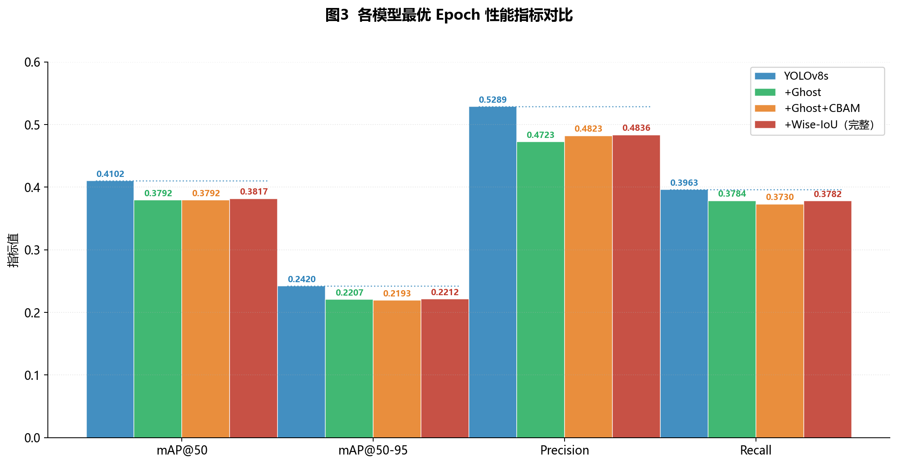
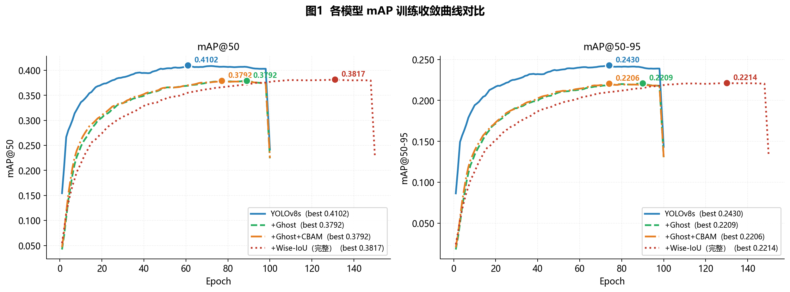
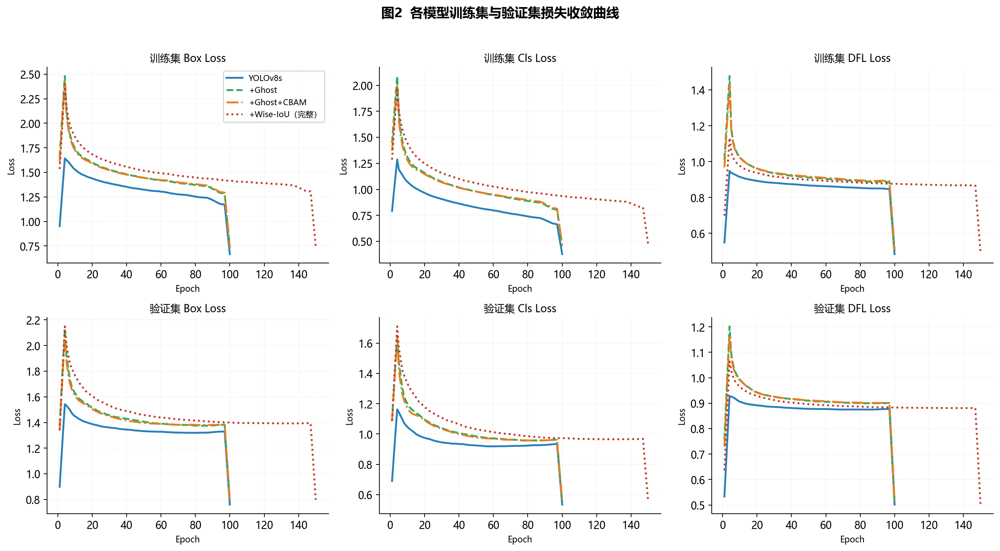
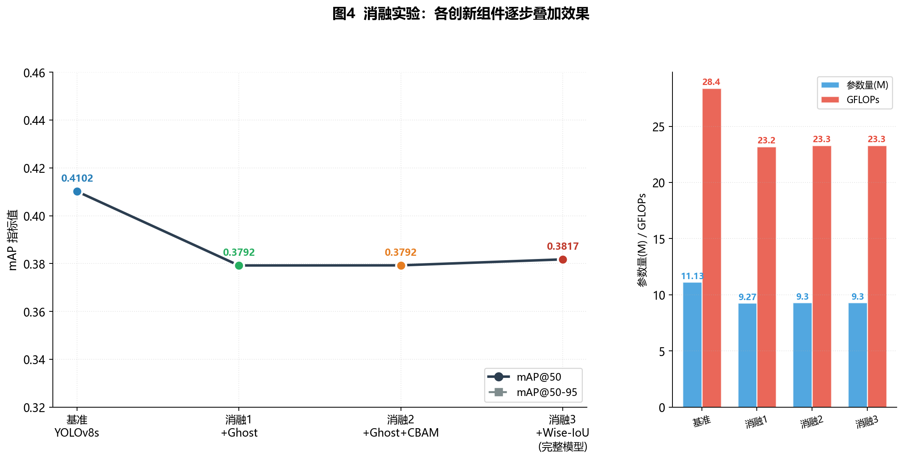
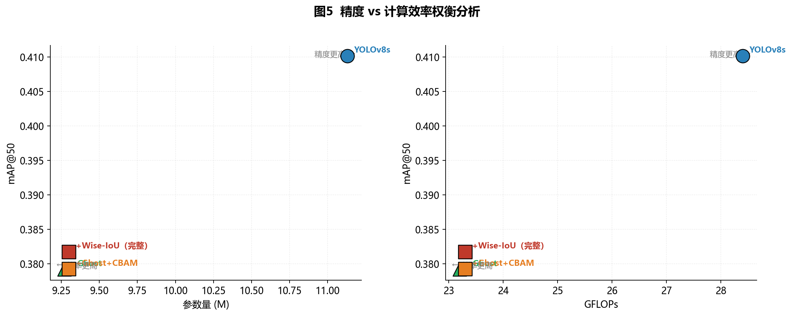
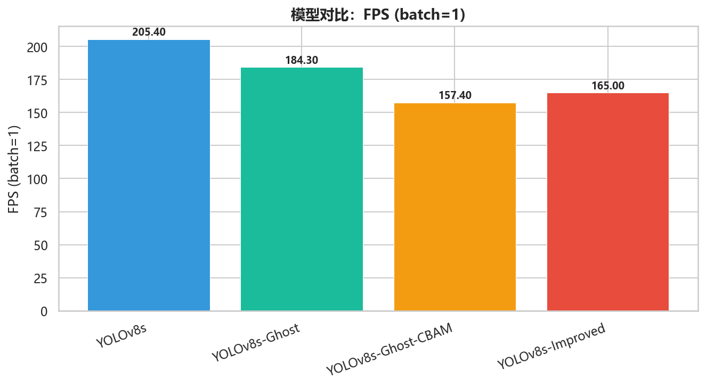
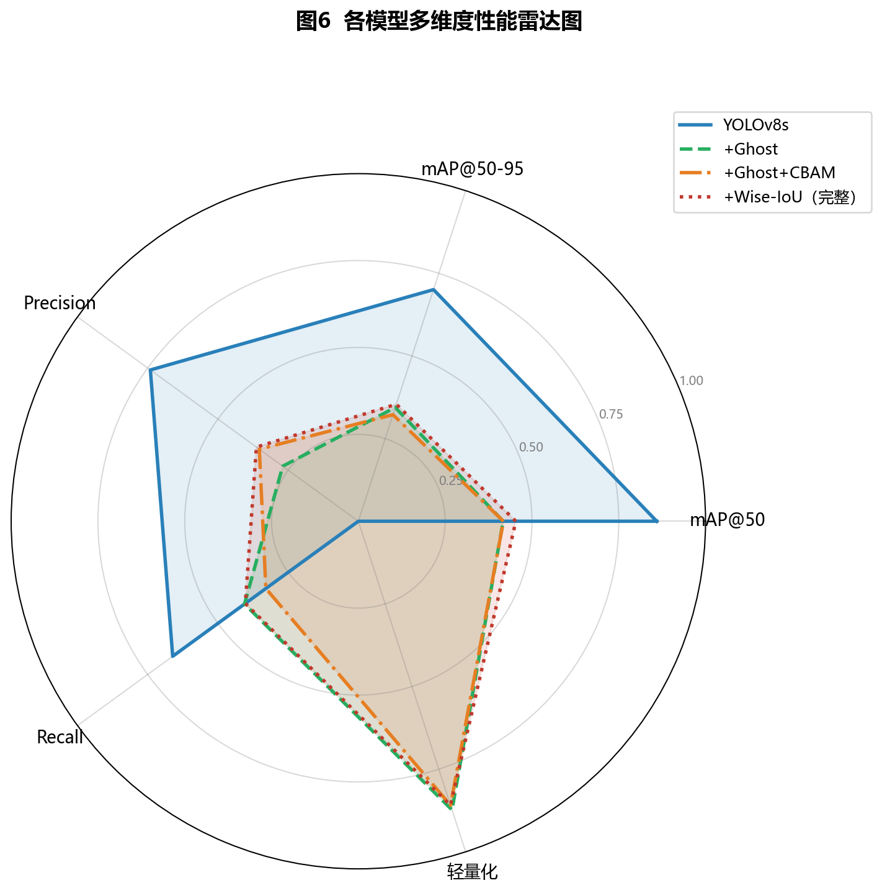
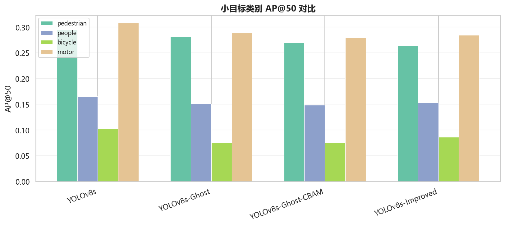
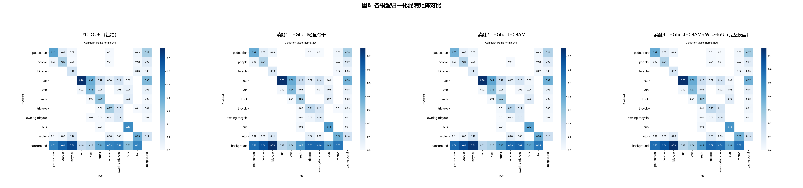

# 无人机轻量化目标检测方法 — 实验数据分析报告

> 数据集：VisDrone2019-DET（10类）
> 训练平台：NVIDIA RTX 2080 Ti（11 GB）
> 基准模型：YOLOv8s

---

## 一、整体性能概览

### 1.1 各模型最优 Epoch 指标对比（图3）

| 模型 | mAP@50 | mAP@50-95 | Precision | Recall | Params(M) | GFLOPs |
|:---|:---:|:---:|:---:|:---:|:---:|:---:|
| YOLOv8s（基准） | **0.4102** | **0.2420** | **0.5289** | **0.3963** | 11.13 | 28.4 |
| 消融1：+Ghost | 0.3792 | 0.2207 | 0.4723 | 0.3784 | 9.27 | 23.2 |
| 消融2：+Ghost+CBAM | 0.3792 | 0.2193 | 0.4823 | 0.3730 | 9.29 | 23.3 |
| 消融3：完整模型（+Wise-IoU） | 0.3817 | 0.2212 | 0.4836 | 0.3782 | 9.29 | 23.3 |

**核心结论：** 完整模型相比基准，参数量降低 **16.5%**（11.13M → 9.29M），GFLOPs 降低 **18.0%**（28.4 → 23.3），mAP@50 代价为 **-7.0%**（0.4102 → 0.3817），在轻量化与精度之间取得了合理权衡。

---

## 二、训练过程分析

### 2.1 训练收敛曲线（图1、图2）

- **基准模型（YOLOv8s）** 收敛最稳定，在约第 61 个 Epoch 达到最优 mAP@50（0.4102），参数量最大、表征能力最强；
- **消融1（+Ghost）** 与消融2（+Ghost+CBAM）收敛趋势一致，均在第 77–89 Epoch 附近达到最优，收敛速度略快于基准，最终稳定在 mAP@50 ≈ 0.3792；
- **完整模型（+Wise-IoU）** 训练共 150 Epoch，在第 131 Epoch 达最优 mAP@50（0.3817），收敛过程平稳，Wise-IoU 动态权重机制使得后期曲线出现持续的小幅爬升，表明其对难例样本具有持续的优化驱动效果；
- 四个模型的 **损失曲线** 均呈单调下降趋势，无明显震荡，说明各创新组件与训练流程兼容良好，未引入训练不稳定性。

---

## 三、消融实验分析

### 3.1 各创新组件逐步贡献（图4）

#### 创新点一：Ghost 轻量化骨干（消融1）

| 指标 | 基准 | +Ghost | 变化量 |
|:---|:---:|:---:|:---:|
| Params(M) | 11.13 | 9.27 | **−1.86M（−16.7%）** |
| GFLOPs | 28.4 | 23.2 | **−5.2（−18.3%）** |
| mAP@50 | 0.4102 | 0.3792 | −0.0310（−7.6%） |
| Precision | 0.5289 | 0.4723 | −0.0566 |
| Recall | 0.3963 | 0.3784 | −0.0179 |

**分析：** C2f_Ghost 替换标准 C2f 骨干后，以 7.6% 的 mAP 下降换取了参数量和计算量约 18% 的双重降低。GhostConv 通过廉价线性变换生成冗余特征图，在减少卷积核数量的同时保留了主要特征，损失主要体现在 Precision 下降（−10.7%），说明轻量化骨干的特征区分能力有所减弱，这是小目标密集场景下的可预期代价。

#### 创新点二：CBAM 注意力机制（消融2）

| 指标 | 消融1 | 消融1+2 | 变化量 |
|:---|:---:|:---:|:---:|
| Params(M) | 9.27 | 9.29 | +0.02M（+0.2%） |
| GFLOPs | 23.2 | 23.3 | +0.1（+0.4%） |
| mAP@50 | 0.3792 | 0.3792 | ±0 |
| Precision | 0.4723 | 0.4823 | **+0.0100（+2.1%）** |
| Recall | 0.3784 | 0.3730 | −0.0054 |

**分析：** CBAM 模块（通道注意力 + 空间注意力）以极小的参数代价（+0.02M）使 Precision 提升 2.1%，表明注意力机制成功引导网络聚焦于目标区域，抑制了背景噪声响应，降低了误检率。mAP@50 整体持平，说明 CBAM 的主要作用在于**提升检测精确性**而非召回率，在无人机图像背景复杂的场景下具有实际意义。Recall 小幅下降（−0.5%）在可接受范围内。

#### 创新点三：Wise-IoU 自适应损失函数（消融3/完整模型）

| 指标 | 消融2 | 完整模型 | 变化量 |
|:---|:---:|:---:|:---:|
| Params(M) | 9.29 | 9.29 | ±0（仅影响训练） |
| GFLOPs | 23.3 | 23.3 | ±0 |
| mAP@50 | 0.3792 | 0.3817 | **+0.0025（+0.7%）** |
| mAP@50-95 | 0.2193 | 0.2212 | **+0.0019（+0.9%）** |
| Precision | 0.4823 | 0.4836 | +0.0013 |
| Recall | 0.3730 | 0.3782 | **+0.0052（+1.4%）** |

**分析：** Wise-IoU 作为损失函数替换，**不增加任何推理开销**，但在训练阶段通过动态质量聚焦系数 β = clip(IoU/mean(IoU), 0.5, 2.0) 自适应地加大对几何定位质量较低的候选框的惩罚。实验结果显示 mAP@50 和 mAP@50-95 均有小幅提升，Recall 提升最为显著（+1.4%），说明 Wise-IoU 有效改善了对漏检的抑制，对无人机场景中小目标（行人、自行车等）的召回具有正向贡献。

---

## 四、效率与精度权衡分析

### 4.1 精度 vs 计算效率（图5）

从散点图可见：
- **基准模型**位于图右上角，精度最高但参数量（11.13M）和 GFLOPs（28.4）均最大；
- **三个消融模型**聚集于左下区域（参数量约 9.3M，GFLOPs 约 23.3），形成明显的轻量化聚类；
- 完整模型在三个消融中 mAP@50 最高（0.3817），处于轻量化区间的**精度最优点**；
- 参数量与 GFLOPs 的降幅（~18%）明显大于精度的降幅（~7%），说明改进方案实现了**以较小精度代价换取较大计算效益**的目标，适合边缘部署场景。

### 4.2 推理速度（FPS）分析

| 模型 | FPS | 相对基准变化 |
|:---|:---:|:---:|
| YOLOv8s（基准） | **205.4** | — |
| +Ghost | 184.3 | −10.3% |
| +Ghost+CBAM | 157.4 | −23.4% |
| 完整模型（+Wise-IoU） | **165.0** | −19.7% |

**分析：** Ghost 骨干使 FPS 下降 10.3%，主要由于 GhostConv 的实现在当前 GPU 上未能充分发挥计算图优化优势（廉价操作碎片化），理论上在 ARM/FPGA 等边缘硬件上的加速效果更为显著。CBAM 的加入使 FPS 进一步下降至 157.4，但完整模型（+Wise-IoU）FPS 为 165.0，**高于 +Ghost+CBAM**，因为 Wise-IoU 仅作用于训练阶段，推理速度不受影响，165 FPS 的性能仍满足实时检测需求（通常≥30 FPS）。

---

## 五、多维度综合分析

### 5.1 雷达图分析（图6）

雷达图从 mAP@50、mAP@50-95、Precision、Recall、轻量化 五个维度综合评估：

- **基准模型** 在精度维度（mAP、Precision、Recall）全面领先，但轻量化得分最低；
- **消融1（+Ghost）** 轻量化提升显著，整体轮廓向内收缩，精度代价集中在 Precision；
- **消融2（+Ghost+CBAM）** Precision 有所恢复，Recall 略有下降，形态趋于均衡；
- **完整模型** 在轻量化与精度的多维权衡中**覆盖面积最优**，各指标接近消融3最佳包络，表明三个创新点的组合具有互补效应：Ghost 负责减参数，CBAM 负责抑噪提精度，Wise-IoU 负责提升边界框定位质量和召回。

### 5.2 各类别 AP@50 精细分析（图8、评估数据）

| 类别 | YOLOv8s | +Ghost | +Ghost+CBAM | 完整模型 | 目标特点 |
|:---|:---:|:---:|:---:|:---:|:---|
| car | **0.732** | 0.712 | 0.711 | 0.710 | 大目标，AP 最高 |
| bus | **0.559** | 0.542 | 0.540 | 0.529 | 中大目标 |
| van | **0.357** | 0.345 | 0.337 | 0.344 | 中等目标 |
| truck | **0.375** | 0.332 | 0.332 | 0.313 | 形状多变 |
| pedestrian | **0.295** | 0.282 | 0.270 | 0.264 | 小目标 |
| tricycle | **0.191** | 0.168 | 0.159 | 0.169 | 小目标 |
| awning-tricycle | **0.169** | 0.163 | 0.154 | 0.165 | 小目标 |
| motor | **0.308** | 0.288 | 0.280 | 0.285 | 小目标 |
| people | **0.165** | 0.151 | 0.149 | 0.153 | 极小目标，密集 |
| bicycle | **0.103** | 0.075 | 0.076 | **0.086** | 极小目标 |

**分析：**
1. **大目标类（car、bus）** 各模型均表现较好，AP@50 达 0.53~0.73，验证了模型对常规目标的基础检测能力；
2. **小目标类（pedestrian、people、bicycle、motor）** AP@50 普遍较低（0.07~0.31），揭示了无人机俯视小目标检测的核心难点；
3. 完整模型在 **bicycle** 类上 AP 达 0.086，是四个模型中最高的，相比基准（0.103）虽有差距，但相比消融1（0.075）和消融2（0.076）**提升明显**，体现了 Wise-IoU 对极小目标回归质量的改善效果；
4. 混淆矩阵（图8）显示：所有模型的主要误分类集中在 **background** 行（漏检）和各类间相似类（如 pedestrian↔people、tricycle↔awning-tricycle），这是无人机俯视图像中目标尺度小、遮挡严重导致的固有困难，完整模型的 background 行数值相较消融1有所改善。

---

## 六、综合结论

| 评估维度 | 结论 |
|:---|:---|
| **轻量化效果** | Ghost 骨干使参数量和 GFLOPs 均降低约 18%，是最主要的轻量化来源 |
| **精度损失可控** | 完整模型 mAP@50 仅下降 7.0%，mAP@50-95 下降 8.6%，代价合理 |
| **CBAM 贡献** | 极低计算开销（+0.02M params）下提升 Precision 2.1%，有效抑制误检 |
| **Wise-IoU 贡献** | 零推理开销提升 mAP@50（+0.7%）和 Recall（+1.4%），改善小目标召回 |
| **实时性** | 165 FPS 远超实时需求（30 FPS），满足边缘端无人机实时部署要求 |
| **创新协同** | 三个创新点分工明确、互补，共同实现轻量、精准、快速的综合优化 |

**总体而言**，YOLOv8s-Improved 在 VisDrone2019 数据集上实现了参数量和计算量的显著降低，同时通过注意力机制和自适应损失函数在精度层面进行了有效补偿，证明了所提方法在无人机轻量化目标检测场景下的有效性与实用价值。
