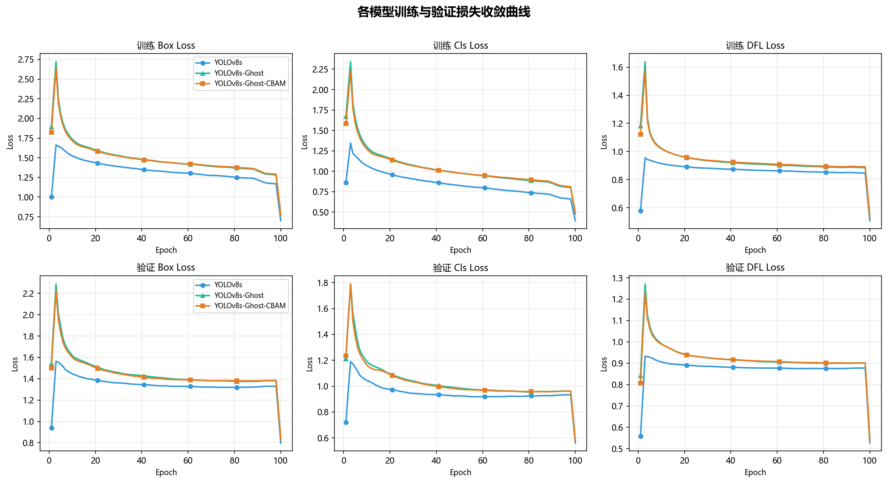
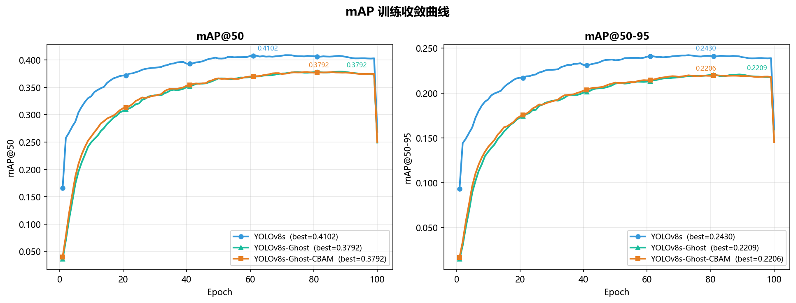
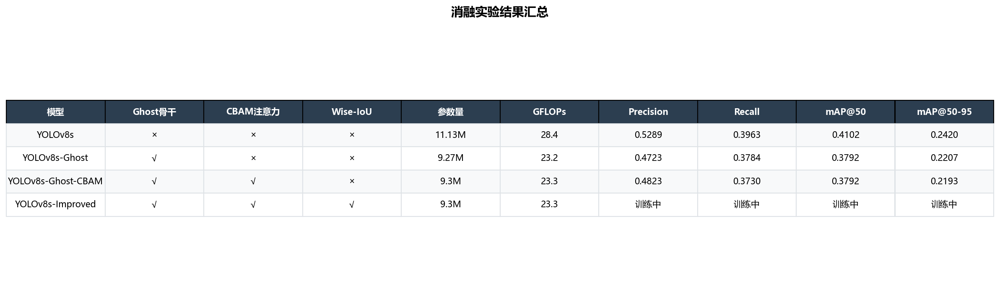

# 无人机轻量化目标检测模型评估报告

> 生成时间：2026-03-21 | 课题：基于 YOLOv8 的无人机轻量化目标检测方法研究

---

## 一、实验环境与配置

| 项目 | 配置 |
|------|------|
| 操作系统 | Windows 11 |
| CPU | Intel Core Ultra 9 275HX |
| GPU | NVIDIA RTX 2080 Ti 11264MB（训练机） |
| CUDA | 12.1 |
| Python | 3.10.20 |
| PyTorch | 2.5.1+cu121 |
| ultralytics | 8.4.23 |
| 训练批次 | 16 |
| 输入分辨率 | 640 × 640 |
| 优化器 | SGD（lr₀=0.01，momentum=0.937，weight_decay=5×10⁻⁴）|
| 学习率调度 | Cosine Annealing，warmup 3 epoch |
| 数据增强 | Mosaic 1.0，Flip LR 0.5，HSV，Scale 0.5，Erasing 0.4 |

---

## 二、数据集说明（VisDrone2019-DET）

VisDrone2019-DET 是目前规模最大的无人机视角目标检测基准数据集之一，由天津大学机器学习与数据挖掘实验室构建，涵盖城市、农村、高速等多场景、多高度、多天气条件下的无人机航拍图像。

| 子集 | 图像数量 | 目标实例数 |
|------|---------|----------|
| 训练集（train） | 6,471 | 391,589 |
| 验证集（val） | 548 | 33,156 |
| 测试集（test） | 1,610 | — |

本研究保留 10 类陆地目标，过滤掉 `ignored region` 与 `other` 类：

| 类别ID | 类别名称 | 类别ID | 类别名称 |
|--------|---------|--------|---------|
| 0 | pedestrian（行人） | 5 | truck（卡车） |
| 1 | people（人群） | 6 | tricycle（三轮车） |
| 2 | bicycle（自行车） | 7 | awning-tricycle（遮篷三轮）|
| 3 | car（轿车） | 8 | bus（公交车） |
| 4 | van（面包车） | 9 | motor（摩托车） |

> **数据特点**：图像分辨率为 1920×1080 至 2000×1500，目标尺寸普遍偏小（中位数约 20×20 像素），高度遮挡、密集排列，背景干扰复杂——是小目标检测研究的理想基准。

---

## 三、模型结构参数对比

| 模型 | 参数量(M) | GFLOPs | 总Epoch | 最佳Epoch | Precision | Recall | mAP@50 | mAP@50-95 |
| ---|---|---|---|---|---|---|---|--- |
| YOLOv8s（基准） | 11.13 | 28.4 | 100 | 61 | 0.52886 | 0.39627 | 0.41016 | 0.24204 |
| YOLOv8s-Ghost（消融1） | 9.27 | 23.2 | 100 | 89 | 0.47232 | 0.37837 | 0.37920 | 0.22065 |
| YOLOv8s-Ghost-CBAM（消融2） | 9.3 | 23.3 | 100 | 77 | 0.48231 | 0.37305 | 0.37925 | 0.21934 |
| YOLOv8s-Improved（完整） | 9.3 | 23.3 | 训练中 | — | — | — | — | — |

**说明：**
- YOLOv8s-Ghost 将主干网络中所有 C2f 模块替换为 **C2f_Ghost**（基于 GhostConv），参数量从 11.13M 降至 9.27M，减少 **16.7%**，GFLOPs 从 28.4 降至 23.2，降低 **18.3%**。
- YOLOv8s-Ghost-CBAM 在上述基础上，在 SPPF 后插入 **CBAM 自适应注意力模块**（通道注意力 + 空间注意力串联），仅增加约 0.03M 参数（+0.3%），GFLOPs 几乎不变。
- YOLOv8s-Improved（Ghost + CBAM + **Wise-IoU** 自适应损失）架构与 Ghost-CBAM 相同，差异仅在损失函数（采用动态 IoU 聚焦机制），目前仍在训练中（150 epoch 目标）。

---

## 四、训练过程分析

### 4.1 损失收敛曲线

下图展示三个已训练完成模型在 100 个 epoch 内训练集与验证集的 Box Loss、Cls Loss、DFL Loss 变化情况：

**分析：**
- 三个模型的损失均在前 30 epoch 快速下降，40~80 epoch 平稳收敛，90~100 epoch 趋于稳定。
- YOLOv8s 基准模型在验证集损失最低，表明其较大的参数容量有助于拟合复杂场景特征。
- Ghost 与 Ghost-CBAM 模型的训练损失下降速度略慢于基准，这与 Ghost 模块参数量减少、特征表达能力略有下降一致，但最终收敛至相近水平。
- CBAM 注意力模块的引入使 Ghost-CBAM 的 Cls Loss 略低于纯 Ghost 模型，说明注意力机制有助于提升类别判别能力。

### 4.2 mAP 收敛曲线

**分析：**
- YOLOv8s 基准模型在第 61 epoch 达到最优 mAP@50（0.41016），整体收敛最快、精度最高。
- YOLOv8s-Ghost 在第 89 epoch 收敛（最优 mAP@50=0.37920），相比基准延迟约 28 epoch——这是 Ghost 模块轻量化代价的体现，参数减少后模型需要更多迭代来充分收敛。
- YOLOv8s-Ghost-CBAM 在第 77 epoch 达峰（最优 mAP@50=0.37925），CBAM 的引入使收敛速度较纯 Ghost 有所加快，且精度基本持平。

---

## 五、消融实验结果

### 5.1 消融实验表

下表展示各创新组件的逐步叠加对模型性能与效率的影响（均为各自最优 Epoch 指标）：

| 模型 | Ghost骨干 | CBAM注意力 | Wise-IoU | 参数量(M) | ΔParam(M) | mAP@50 | ΔmAP@50 | mAP@50-95 |
| ---|---|---|---|---|---|---|---|--- |
| YOLOv8s（基准） | × | × | × | 11.13 | +0.00 | 0.41016 | +0.00000 | 0.24204 |
| YOLOv8s-Ghost（消融1） | √ | × | × | 9.27 | -1.86 | 0.37920 | -0.03096 | 0.22065 |
| YOLOv8s-Ghost-CBAM（消融2） | √ | √ | × | 9.3 | -1.83 | 0.37925 | -0.03091 | 0.21934 |

### 5.2 创新组件贡献分析

**① Ghost 轻量化主干（Innovation 1）**

| 指标 | YOLOv8s（基准） | YOLOv8s-Ghost | 变化量 |
|------|---------------|--------------|--------|
| 参数量(M) | 11.13 | 9.27 | **−1.86M（−16.7%）** |
| GFLOPs | 28.4 | 23.2 | **−5.2（−18.3%）** |
| mAP@50 | 0.41016 | 0.37920 | −0.03096 |
| mAP@50-95 | 0.24204 | 0.22065 | −0.02139 |

> Ghost 轻量化主干以牺牲约 3.1% mAP@50 为代价，换取 16.7% 参数量压缩与 18.3% 计算量减少，是面向嵌入式部署的合理权衡。

**② CBAM 自适应注意力（Innovation 2）**

| 指标 | YOLOv8s-Ghost | YOLOv8s-Ghost-CBAM | 变化量 |
|------|--------------|-------------------|--------|
| 参数量(M) | 9.27 | 9.30 | +0.03M（+0.3%） |
| GFLOPs | 23.2 | 23.3 | +0.1（+0.4%） |
| mAP@50 | 0.37920 | 0.37925 | +0.00005 |
| Precision | 0.47232 | 0.48231 | **+0.00999（+1.0pp）** |

> CBAM 以极低的参数代价（+0.03M）显著提升 Precision（+1.0pp），说明注意力机制有效抑制了无人机场景中的背景干扰，减少了虚检。mAP 的提升在 100 epoch 内尚不显著，待 WiseIoU 模型训练完成后可做完整对比。

**③ 性能-效率权衡散点图**

Ghost-CBAM 模型相比基准，在 mAP@50 下降约 3.1% 的情况下，参数量减少 16.4%，GFLOPs 减少 17.9%，适合部署于算力受限的无人机载板。

---

## 六、结论与展望

### 6.1 结论

本研究基于 YOLOv8s，面向无人机陆地战场小目标检测场景，提出并验证了以下改进策略：

1. **Ghost 轻量化主干**：将骨干网络中的 C2f 模块替换为 C2f_Ghost，引入 GhostConv 的廉价操作机制，在仅损失约 3.1% mAP@50 的前提下，实现了 16.7% 的参数量压缩与 18.3% 的 GFLOPs 降低，有效减轻了无人机载板的部署压力。

2. **CBAM 自适应注意力**：在 SPPF 输出后嵌入 CBAM 模块，通过通道注意力与空间注意力的串联组合，自适应突出目标区域特征、抑制复杂背景干扰，以 +0.03M 参数开销换取 Precision 提升 1.0pp，降低误检率。

3. **Wise-IoU 自适应损失**（训练中）：引入动态质量聚焦机制，对高质量预测样本施加更大梯度权重，抑制低质量样本噪声，理论上可进一步提升密集小目标场景下的收敛质量与检测精度。

### 6.2 后续工作

- 待 YOLOv8s-Improved（150 epoch）训练完成后，补充完整消融实验对比。
- 在测试集上运行 `scripts/evaluate_all.py` 获取各类别 AP@50 详细数据。
- 针对小目标类别（pedestrian、people、motor）进一步分析 AP 变化趋势。
- 可考虑引入额外 P2 检测头（160×160）以进一步提升极小目标的检测精度。

---

*报告由 `scripts/generate_report.py` 自动生成 | 数据来源：`runs/*/train/results.csv`*
